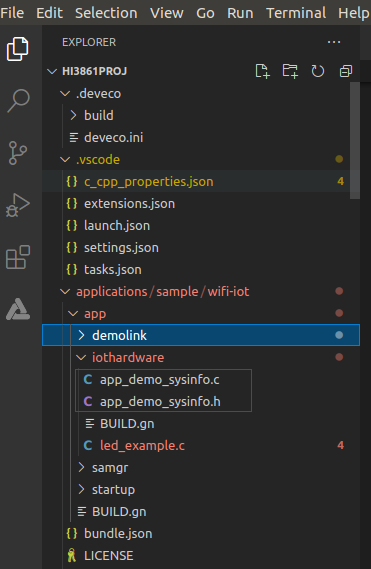
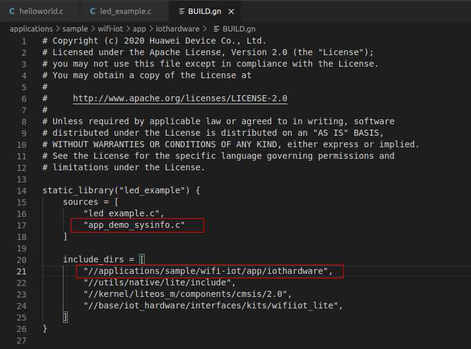
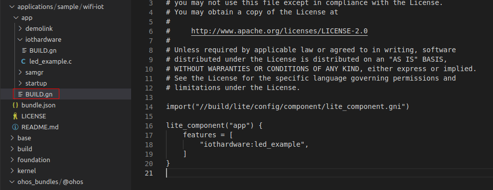

### Profiling功能
此功能是基于L0开发的应用程序，能够查询开发板上运行程序所使用的系统资源及内存资源信息，用于帮助开发者查看开发板上各任务堆内存和栈内存使用情况。
### Profiling功能实现原理
开发者在当前应用程序中添加任务定时查询内存信息和系统资源信息，并按照与DevEco Device Tool插件约定好的格式，通过串口打印输出；Profiling通过解析输出数据，生成分析曲线反馈给开发者。
### 使用Profiling功能的方法
示例：在applications/sample/wifi-iot/app/iothardware应用程序中增加profiling功能  
- step1. 将src目录下的`app_demo_sysinfo.h`和`app_demo_sysinfo.c`拷贝到应用工程目录中。  
  

- step2. 在当前应用的编译脚本`BUILD.gn`中sources中加入`app_demo_sysinfo.c`文件路径；在include_dirs中加入`app_demo_sysinfo.h`文件路径。  
    ```
    static_library("led_example") {
        sources = [
            "led_example.c",
            "app_demo_sysinfo.c"
        ]

        include_dirs = [
            "//applications/sample/wifi-iot/app/iothardware",
            "//utils/native/lite/include",
            "//kernel/liteos_m/components/cmsis/2.0",
            "//base/iot_hardware/interfaces/kits/wifiiot_lite",
        ]
    }
    ```
      
(编译时若提示"iot_gpio.h"文件不存在，请把`"//base/iot_hardware/interfaces/kits/wifiiot_lite"` 换成 `"//base/iot_hardware/peripheral/interfaces/kits"`)

- step3. 在当前应用的入口函数所在的源码文件`led_example.c`添加头文件`#include "app_demo_sysinfo.h"`, 在入口函数调用`app_demo_heap_task();`  
  
  

- step4. 修改`app/BUILD.gn`，重新编译并烧录程序到目标板上，复位开发板，点击`Profiling->Live capture`，即可显示各种资源使用信息了。  
    ```
    import("//build/lite/config/component/lite_component.gni")
    lite_component("app") {

        features = [
            "iothardware:led_example",
        ]
    }
    ```
      

捕获数据:  
  
