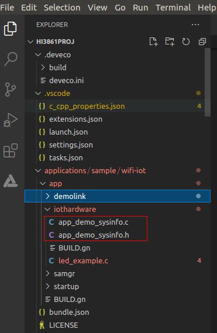
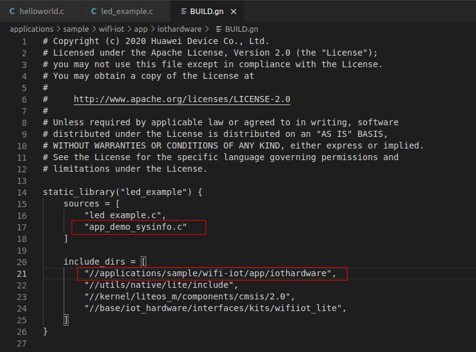
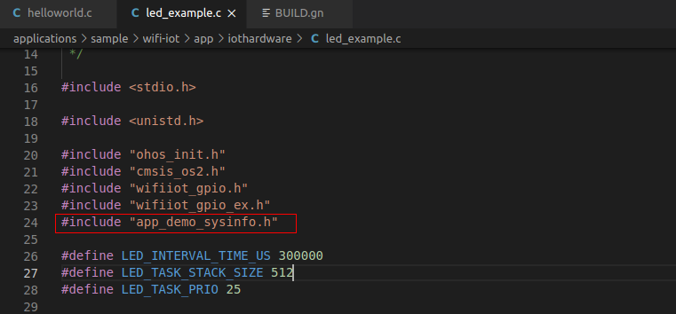
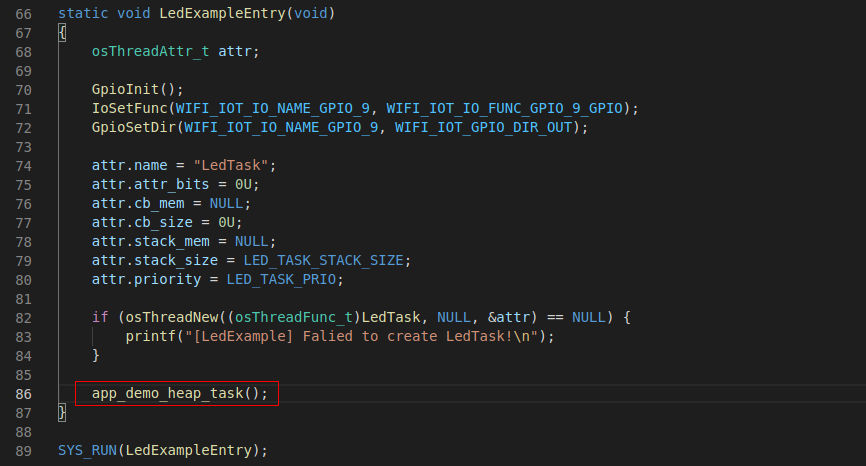
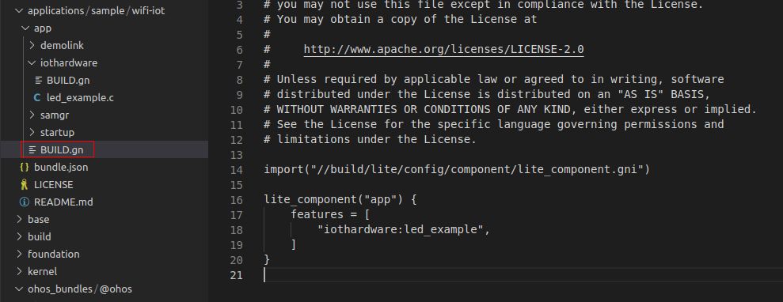
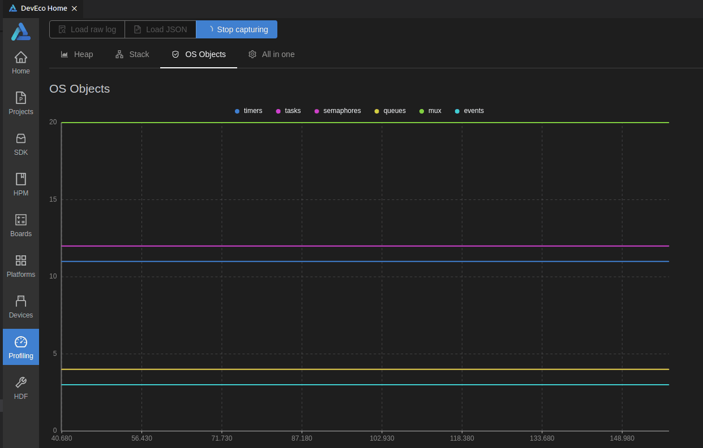

### Profiling Function
This function is developed based on L0. It can be used to query system and memory resources used by apps running on the development board, providing assess to view the heap and stack memory usages of each task.
### Profiling Function Implementation Principle
Add a task for the app to periodically query the memory and system resource information, and print the information in the format required by the DevEco Device Tool plugin through the serial port to obtain data and an analysis report.
### Methods of Using the Profiling Function
Example: Add Profiling Function to the applications/sample/wifi-iot/app/iothardware application  
- step1. Copy the `app_demo_sysinfo.h` and `app_demo_sysinfo.c` files in the src directory to the app directory of the project.  
  

- step2. Add the path of the `app_demo_sysinfo.c` file to the sources in the `BUILD.gn` compilation script of the app. Add the path of the `app_demo_sysinfo.h` file to include_dirs.  
    ```
    static_library("led_example") {
        sources = [
            "led_example.c",
            "app_demo_sysinfo.c"
        ]

        include_dirs = [
            "//applications/sample/wifi-iot/app/iothardware",
            "//utils/native/lite/include",
            "//kernel/liteos_m/components/cmsis/2.0",
            "//base/iot_hardware/interfaces/kits/wifiiot_lite",
        ]
    }
    ```
      
(If error message is displayed indicating that "iot_gpio.h" file does not exist during compilation, please change `"//base/iot_hardware/interfaces/kits/wifiiot_lite"` to `"//base/iot_hardware/peripheral/interfaces/kits"`.)

- step3. Add the `#include "app_demo_sysinfo.h"` header file to the source code file `led_example.c` where the entry function of the app is located. Call the `app_demo_heap_task();` function in the entry function.  
  
  

- step4. Modify `app/BUILD.gn`, recompile and upload the program to the target board and reset, then go to `Profiling > Live` capture to obtain the resource usage information.  
    ```
    import("//build/lite/config/component/lite_component.gni")
    lite_component("app") {

        features = [
            "iothardware:led_example",
        ]
    }
    ```
      

Capturing Data:  
  

